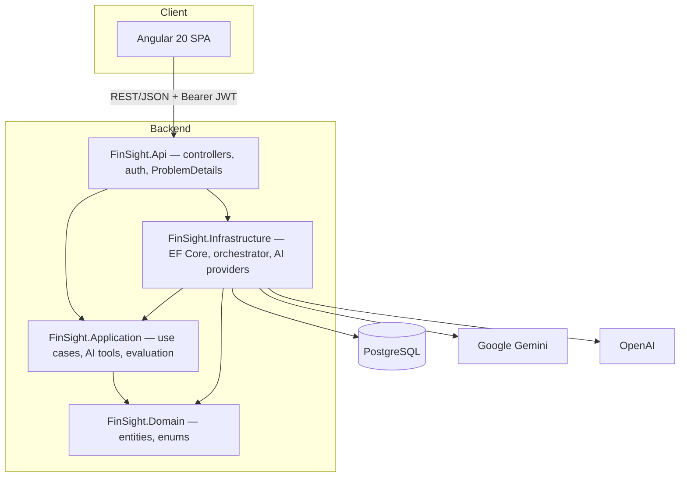
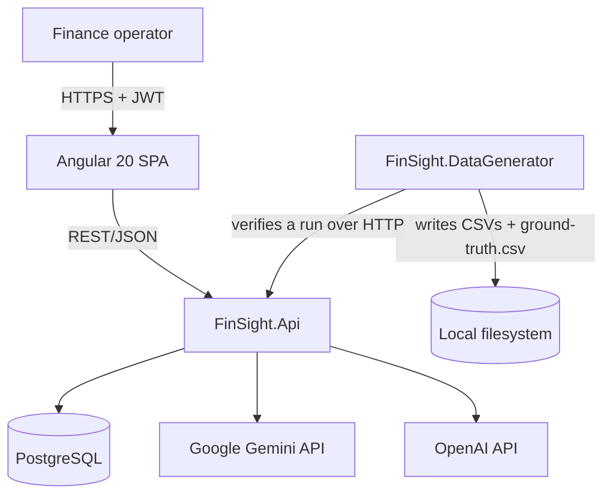
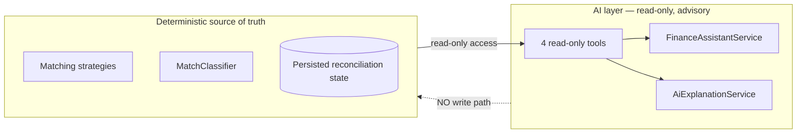
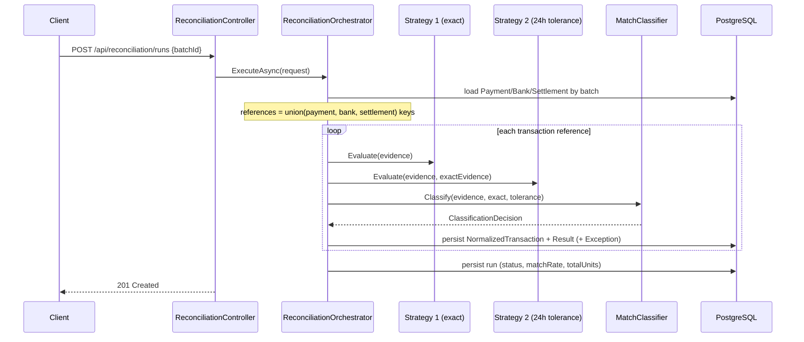
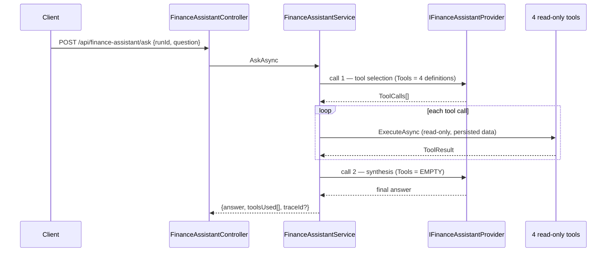

# System Architecture

`[CODE]` Verified against current source. Clean Architecture, dependency direction
correct, **no rewrite required or recommended**.

---

## Project dependency graph

```
FinSight.Domain            (no project references)
   ▲
FinSight.Application       (→ Domain)
   ▲
FinSight.Infrastructure    (→ Application, Domain; owns EF Core, Npgsql, Gemini, OpenAI, JWT)
   ▲
FinSight.Api               (→ Application, Infrastructure)
   ▲
FinSight.Tests             (→ all)

FinSight.DataGenerator     (→ Domain, Application; standalone console)
```

### Dependency rules — enforced

- Domain must never reference Application / Infrastructure / Api. `[CODE]` currently true.
- Application must never reference Infrastructure, EF Core, Npgsql, or any AI SDK.
  `[CODE]` currently true.
- Controllers must not contain reconciliation or matching logic. `[CODE]` currently true.
- Infrastructure must never be referenced *by* Api's domain logic — only composed in DI.

---

## Container view



## System context



---

## Trust boundary — the defining property



`[CODE]` Verified by absence: neither `AiExplanationService` nor
`FinanceAssistantService` nor any of the four tools contains a write path into
`ReconciliationResult.Status`, `ReconciliationRun.MatchRate`, or any `Amount` field. The
only fields AI ever writes are the exception's own `AiExplanation`,
`AiSuggestedCategory`, and `AiExplanationGeneratedAt`.

**Frontend consequence:** this boundary must be *visible*, not merely true. See
[design/05-ai-ux.md](../design/05-ai-ux.md).

---

## Reconciliation flow



## AI request flow



Recursion is impossible by construction — the second call is built with an empty tool
array and throws if the model attempts a tool call anyway. See
[architecture/06-ai-architecture.md](06-ai-architecture.md).

---

## External integrations

| Integration | Package | Role |
|---|---|---|
| PostgreSQL | `Npgsql.EntityFrameworkCore.PostgreSQL` | System of record |
| Google Gemini | `Google.GenAI` | Primary AI provider |
| OpenAI | `OpenAI` | Fallback AI provider |

Reconciliation never calls an AI provider. Its throughput therefore **cannot** be
degraded by AI latency — a genuine architectural strength worth stating explicitly.
